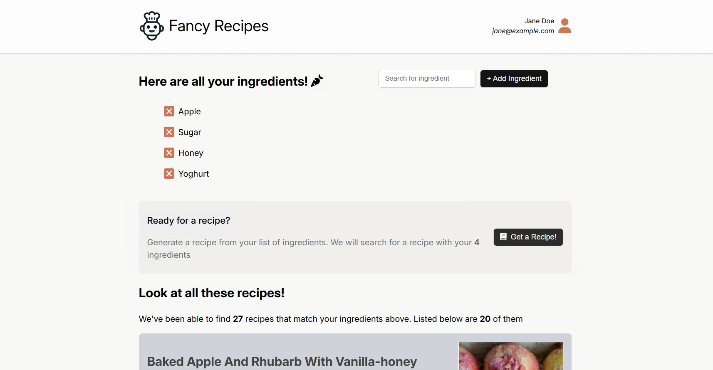

# Simple React Recipe App

Sample react based web-app where you can enter a list of ingredients and use the [Edaman API](https://api.edamam.com) to find a list of recipes with those ingredients.

## Project Tech Specs

- React 19 SPA web app
- Based on VITE
- Uses SCSS for simple styling
- Uses Express JS as a simple backend to connect to Edaman recipe APO

## Running the project
Run both the front-end and back-end as outlined below to view this locally

### Backend

Start in a new terminal `npm start` which will run the express server locally

### Frontend

Start in a new terminal `npm run dev` which will run the react front-end / vite locally 

